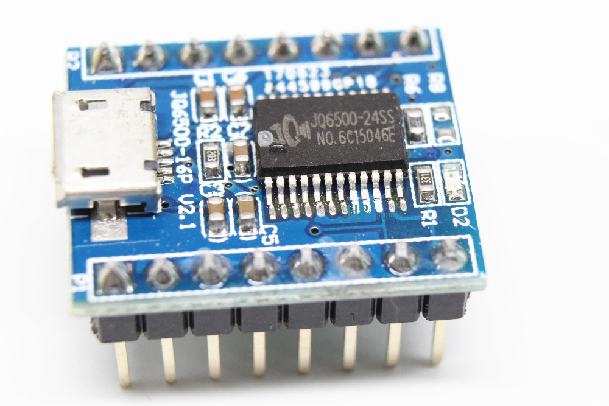

# JQ6500-tool
Tool for uploading and downloading JQ6500 MP3 module

This one: https://www.elecfreaks.com/wiki/index.php?title=JQ6500_Mini_MP3_Module

The device has about 1834900 bytes for MP3 data.

Install python-scsi first: https://github.com/rosjat/python-scsi.git

To write tracks:

sudo python jq6500tool.py track01.mp3 track02.mp3 track03.mp3

The device is identified as CD-ROM and SD card reader composite device in the kernel log:

[ 3681.857961] usb 4-2: new full-speed USB device number 6 using uhci_hcd
[ 3682.038066] usb 4-2: New USB device found, idVendor=e2b8, idProduct=0811
[ 3682.038069] usb 4-2: New USB device strings: Mfr=1, Product=2, SerialNumber=1
[ 3682.038071] usb 4-2: Product: CD002
[ 3682.038073] usb 4-2: Manufacturer: CD002
[ 3682.038075] usb 4-2: SerialNumber: CD002
[ 3682.040151] usb-storage 4-2:1.0: USB Mass Storage device detected
[ 3682.040648] scsi host8: usb-storage 4-2:1.0
[ 3683.066138] scsi 8:0:0:0: Direct-Access     CAI      CD002-1          1.00 PQ: 0 ANSI: 0
[ 3683.069142] scsi 8:0:0:1: CD-ROM            YULIN     PROGRAMMER      4.05 PQ: 0 ANSI: 2
[ 3683.070182] sd 8:0:0:0: Attached scsi generic sg4 type 0
[ 3683.082134] sd 8:0:0:0: [sdd] Attached SCSI removable disk
[ 3683.089179] sr 8:0:0:1: [sr1] scsi-1 drive
[ 3683.089479] sr 8:0:0:1: Attached scsi CD-ROM sr1
[ 3683.089608] sr 8:0:0:1: Attached scsi generic sg5 type 5

The module has 2MB flash memory

Memory map:
0x000000 - 0x03ffff  CD-ROM image
0x040000 - 0x1fffff  Header and MP3 data

# Header addresses:
# 0-7 constant bytes
# 8-23 ignored / garbage ?
# 24 count of tracks
# 28 + n*8 address
# 32 + n*8 length
# 36 + count*8 track1
#
# Example headers
# 05 00 00 00 18 00 04 00 ec 42 06 00 f0 42 06 00 f4 42 06 00 f8 42 06 00 01 00 00 00
# 05 00 00 00 18 00 04 00 62 00 04 00 66 00 04 00 6a 00 04 00 6e 00 04 00 03 00 00 00
# 05 00 00 00 18 00 04 00 57 8c 04 00 5b 8c 04 00 5f 8c 04 00 63 8c 04 00 02 00 00 00

To check the CD-ROM image

sudo python jq6500tool.py -r MusicDownload.iso -s 1024 -o 0
sudo mount -o loop MusicDownload.iso /mnt
ls -l /mnt/
total 78
-r-xr-xr-x 1 root root    37 maali 12  2013 autorun.inf
-r-xr-xr-x 1 root root    99 tammi 14  2014 config.ini
-r-xr-xr-x 1 root root 77904 tammi 14  2014 MusicDownload.exe
